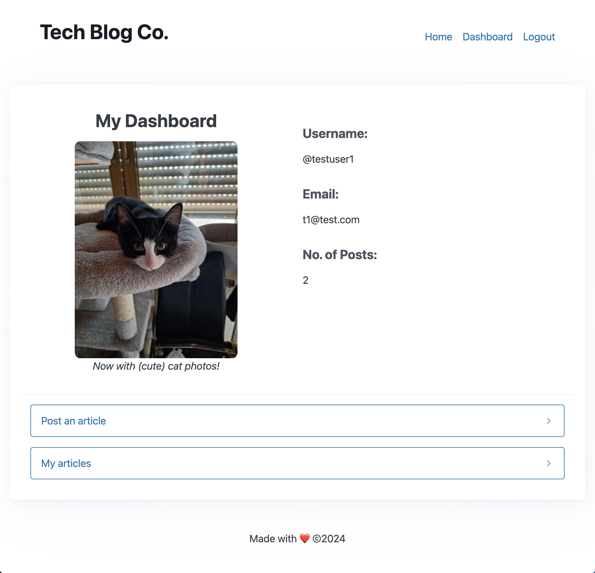
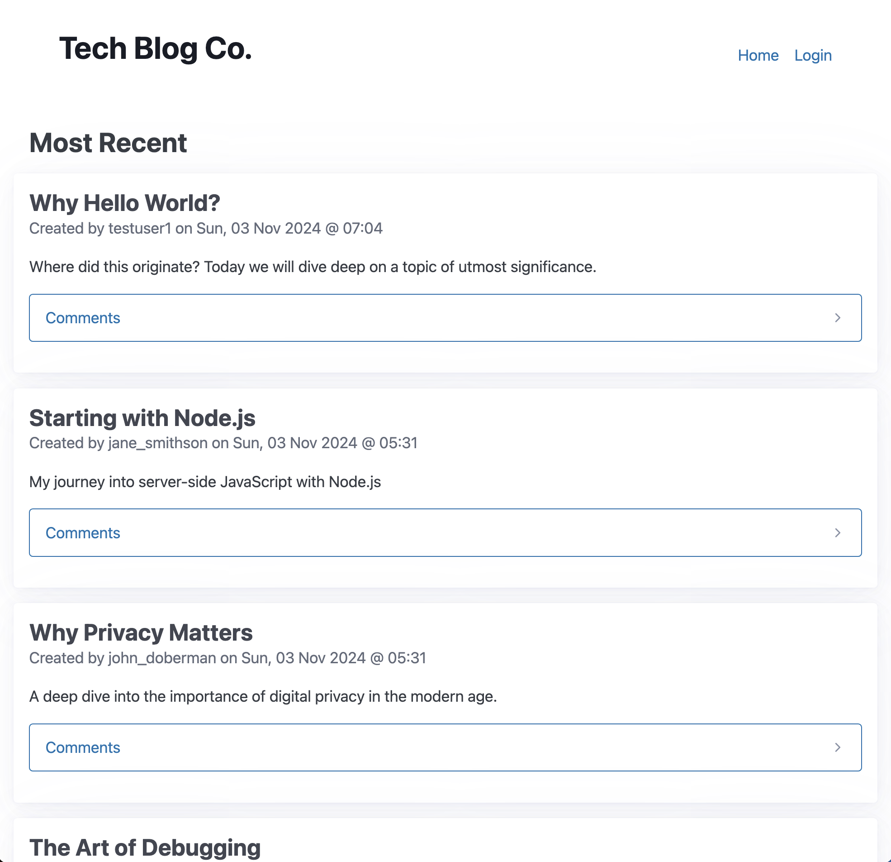

# Simple CMS-Powered Tech Blog

## Description
A place where developers can publish blog posts and comment on other dev's posts.
## Table of Contents
- [Installation](#installation)
- [Usage](#usage)
- [Screenshots](#screenshots)
- [License](#license)
- [Contributors](#Contributors)
- [Questions](#questions)
## Installation
1. Install PostgreSQL and NodeJS.
2. Clone the repo.
3. Navigate to the folder.
4. Run the commands:
      - npm i
      - npm run reset
      - npm run seed

5. Start the server.

## Usage
To use this app, you must first start the server:
1. Run the command:
      - npm run start 
2. Navigate to the web URL 
3. You will need to create an account to start posting.
## License
      This project is licensed under the MIT license.
## Screenshots

## Contributors
@alvin-est
## Questions
If you have any questions, please contact me at [contact@alvin-the.dev](mailto:contact@alvin-the.dev). You can also find me on GitHub at [@alvin-est](https://github.com/@alvin-est).  
